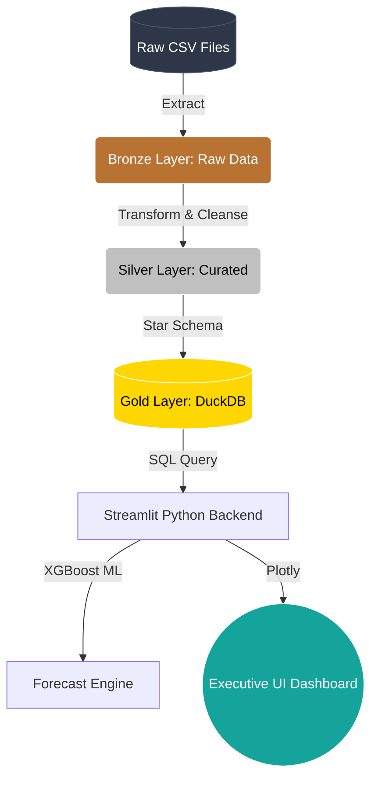

<div align="center">
   &nbsp;&nbsp;&nbsp;
   &nbsp;&nbsp;&nbsp;
  
  
  # Touchpoint Business Intelligence Architecture
  **Executive Dashboard & Predictive Analytics Case Study**
  
  <i>Architected for Scale. Designed for Executives.</i>
</div>

---

## 🎯 1. Executive Summary

This repository houses a comprehensive end-to-end Data Engineering and Business Intelligence solution developed for the **TouchPoint Consulting** recruitment case study. The project analyzes raw retail sell-out data for *Beverama*, the world's leading beverage producer (33% global market share), focusing on its strategic entry into a new local market via two major retail chains.

Instead of a basic analysis script, this project implements a **Senior-level Data Architecture**, prioritizing memory efficiency, strict relational modeling, and an intuitive UI/UX that requires zero technical knowledge from the end-user (C-level executives).

---

## 🏗️ 2. The Architecture (Native Medallion ELT)

To avoid Pandas Out-Of-Memory (OOM) bottlenecks in production, the data engine relies entirely on **DuckDB**, an in-process columnar SQL database.



### 🧠 The "Missing SKU" Strategy (Master Data Audit)
During the ingestion phase, over 110,000 units sold were found to have no mapping in the Master Items dataset. 
* **The Junior Approach:** Drop the rows, causing massive financial reconciliation errors.
* **Our Strategic Approach:** Dynamically intercept the unmapped SKUs in the ETL layer, mapping them to the parent company (`Beverama`) to preserve 100% of global revenue. Concurrently, the SKU name was forcefully rewritten to `⚠️ UNMAPPED (Missing SKU)` to instantly trigger visual alarms on the dashboard for the MDM (Master Data Management) team.

---

## 📊 3. The Dashboard UI/UX

The visualization layer (Streamlit) was built following 2026 Executive UX standards:

* 🎛️ **Stateful Context Filters:** Managers can instantly slice the entire business by Time, Client, City, or Sub-Brand. 
* 📈 **Waterfall YoY Bridge:** Explains exactly which Sub-Brands drove revenue growth or contraction compared to the previous year, mathematically adjusting for Year-To-Date (YTD) discrepancies.
* 🎯 **Dynamic KPI Targets:** The Target Gauge doesn't use arbitrary numbers. It dynamically calculates the *All-Time Best Historic Year* for the exact filter context, constantly challenging management to beat their best historical performance.
* 🤖 **AI Forecasting:** An embedded `XGBoost` regression model predicts the next 6 months of revenue. The pipeline includes an anti-poisoning mechanism that detects and excludes the final incomplete month (Jan 2020) from the training set, guaranteeing stable ML predictions.

---

## ⚙️ 4. Local Execution

Clone the repository and run the engine locally:

```bash
# 1. Install dependencies
pip install -r requirements.txt

# 2. Run the ELT Engine (Generates gold_layer.duckdb)
python etl_pipeline.py

# 3. Launch the Dashboard
streamlit run dashboard.py
```

---
<div align="center">
  <i>"Data is only as valuable as the decisions it drives."</i>
</div>
