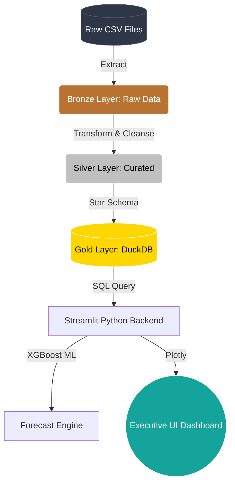

<div align="center">
   &nbsp;&nbsp;&nbsp;
   &nbsp;&nbsp;&nbsp;
  
  
  # Touchpoint Business Intelligence Architecture
  **Executive Dashboard & Predictive Analytics Case Study**
  
  <i>Architected for Scale. Designed for Executives.</i>

  [](https://share.streamlit.io/)
</div>

---

## 📖 1. Business Context & Objective (The Story)

**Beverama** is the world's largest beverage producer, holding a massive **33% global market share** with 57 locations worldwide and UK operations based in Scarborough. Their ethos is *"It's all tasty"*, focusing on healthy options, supplier relationships, and sustainable growth (such as investments in wind turbines).

**The Challenge:** Beverama recently entered a new local market, focusing their distribution on the two largest retail chains (a mix of medium and large-format supermarkets). 

**The Objective:** As a Junior Analyst for TouchPoint Consulting, the goal is to ingest raw, unformatted retail sell-out data across four different sources (Clients, Stores, Items, and Sales). The objective is to build a robust relational model and a Business Intelligence dashboard that translates this raw data into clear, actionable insights regarding sales evolution, volume, and value across their sub-brand portfolio (*Beverama, Bevty, Juiced, and Wipe Bevs*).

---

## 📂 2. Repository Structure

To demonstrate professional software engineering standards, the project is organized into a modular pipeline:

```text
Touchpoint_BI_Project/
├── data/
│   ├── raw/               # Raw CSVs (Clients, Items, Sales, Store)
│   └── processed/         # Output: gold_layer.duckdb
├── src/
│   ├── etl/
│   │   └── etl_pipeline.py           # Data extraction, cleansing, and Medallion modeling
│   ├── dashboard/
│   │   └── dashboard.py              # Streamlit UI & XGBoost Machine Learning
│   └── docs/
│       └── generate_super_pdf.py     # Automated PDF Report generator (FPDF2)
├── Super_Guia_Tecnico_Touchpoint.pdf # Comprehensive technical and business guide
├── requirements.txt
└── README.md
```

---

## 🏗️ 3. The Architecture (Native Medallion ELT)

To avoid Pandas Out-Of-Memory (OOM) bottlenecks in production, the data engine relies entirely on **DuckDB**, an in-process columnar SQL database.



### 🧠 The "Missing SKU" Strategy (Master Data Audit)
During the ingestion phase, over 110,000 units sold were found to have no mapping in the Master Items dataset. 
* **The Junior Approach:** Drop the rows, causing massive financial reconciliation errors.
* **Our Strategic Approach:** Dynamically intercept the unmapped SKUs in the ETL layer, mapping them to the parent company (`Beverama`) to preserve 100% of global revenue. Concurrently, the SKU name was forcefully rewritten to `⚠️ UNMAPPED (Missing SKU)` to instantly trigger visual alarms on the dashboard for the MDM (Master Data Management) team.

---

## 📊 4. The Dashboard UI/UX

The visualization layer (Streamlit) was built following 2026 Executive UX standards:

* 🎛️ **Stateful Context Filters:** Managers can instantly slice the entire business by Time, Client, City, or Sub-Brand. 
* 📈 **Waterfall YoY Bridge:** Explains exactly which Sub-Brands drove revenue growth or contraction compared to the previous year, mathematically adjusting for Year-To-Date (YTD) discrepancies.
* 🎯 **Dynamic KPI Targets:** The Target Gauge doesn't use arbitrary numbers. It dynamically calculates the *All-Time Best Historic Year* for the exact filter context, constantly challenging management to beat their best historical performance.
* 🤖 **AI Forecasting:** An embedded `XGBoost` regression model predicts the next 6 months of revenue. The pipeline includes an anti-poisoning mechanism that detects and excludes the final incomplete month (Jan 2020) from the training set, guaranteeing stable ML predictions.

---

## ⚙️ 5. Local Execution

Clone the repository and run the engine locally:

```bash
# 1. Install dependencies
pip install -r requirements.txt

# 2. Run the ELT Engine (Generates gold_layer.duckdb)
python src/etl/etl_pipeline.py

# 3. Launch the Dashboard
streamlit run src/dashboard/dashboard.py
```

---
<div align="center">
  <i>"Data is only as valuable as the decisions it drives."</i>
</div>
